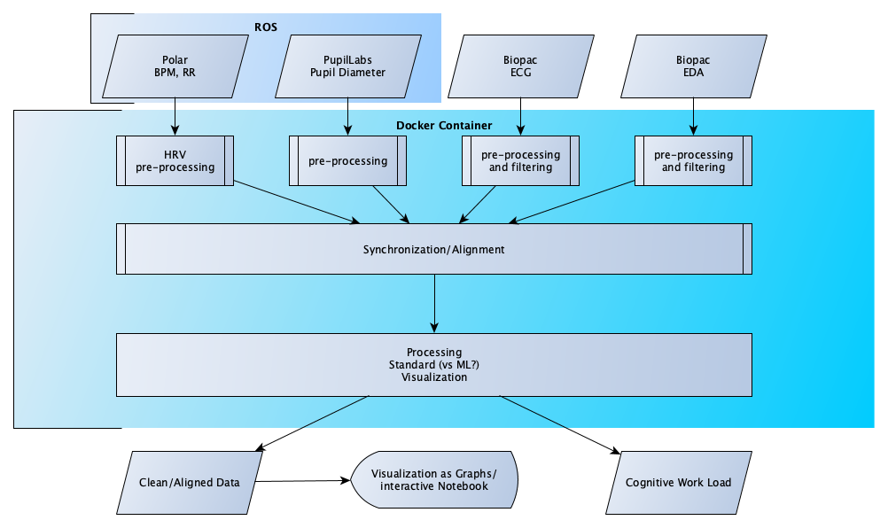

## ECG Pupillometry Pipeline
### Brain Hack School 2019 Project by Marcel Kaufmann
---
# Video Introduction to this Brain Hack Project

(Click on image to play)

# Summary

This Brain Hack project is about creating a processing pipeline for ECG and pupillometry data. The motivation behind this task is that our lab ([MIST Lab @ Polytechnique Montreal](https://mistlab.ca)) is currently conducting a Human-Robot-Interaction user study in which we collect the following data:
* Pupillometry (Pupil Labs Eye Tracker)

 

* Heart rate and RR intervals (Polar H7 fitness tracker)

* ECG, EDA from Biopac (as acq files)

The collection pipeline has been established using ROS (the robot operating system), while the data from the biopac sensors is recorded manually for each participant. An analysis pipeline did not exist and the synchronization/merging of the collected data had not been implemented before Brain Hack.

In addition, this pipeline could be used to process signals that have been collected outside of our lab. E.g., there is Biopac recordings that have been recorded inside of MRI scanners. This data is very noisy and could possibly be filtered based on the code base of this project.

# Project Definition and Overview

To further define the project, the following figure shows a project overview:
Starting point is the different data streams that exist in either a ROSbag or text (csv) format. The ROSbag has been decoded in a pre-processing step (https://github.com/mtl-brainhack-school-2019/ecg_pupillometry_pipeline_kaufmann/blob/master/pre-processing/bag_to_csv.py), so that for this project the data can be imported into the jupyter notebooks easily.

#### Planned Deliverables

Ideally, at the end of this project, there will be a dockerized tool to process and visualize the collected and filtered data in *fancy* plots. The docker container could be use as a pure processing pipeline, but can contain a Notebook-Tutorial on how to process the data and use above mentioned tools. If possible, one of the outputs should be cognitive work load so that this data (output) can be used for future projects.

#### Datasets

The data that is going to be processed is unfortunately not openly available due to ethics reasons. It is planned to add a personal or simulated dataset as an example.

# Project Progress and Learning Experience

The project allowed me to learn about containerization with docker and exposed me extensively to Jupyter Notebooks. There is different ways to manage ones Python environment such as Anaconda and Pip. During the course of the Project I created two Jupyter Notebooks, one which evolved over time with different data visualization and analysis steps and another one for the final presentation. All code lives in this GitHub repository and is also available in a docker container.

#### Tools and Techniques I used and learned during Brain Hack

* 
* 
* Pandas
* NeuroKit / HRVanalysis
* Ipython Notebooks
* Dynamic Time Warping

#### Outputs
With the scripts I created, I can calculate statistics in order to compare and correlate the following physiological signals:

* Heart Rate Variability
* De-noised ECG
* Filtered Pupillometry

A direct measurement of 
* Cognitive Workload 
has yet to be derived and implementd. Brain Hack allowed me to learn a lot about my data and helped me improve the recording as well as pre-processing steps for this project. The use of containers makes it easy to reproduce my current results. When working with container, it is important to keep in mind that one is working with snapshots and needs to save and commit work in progress properly (don't close your container by accident).  

# Results

To visualize and reproduce the results, you can run this code using docker.

# Acknowledgements
  

